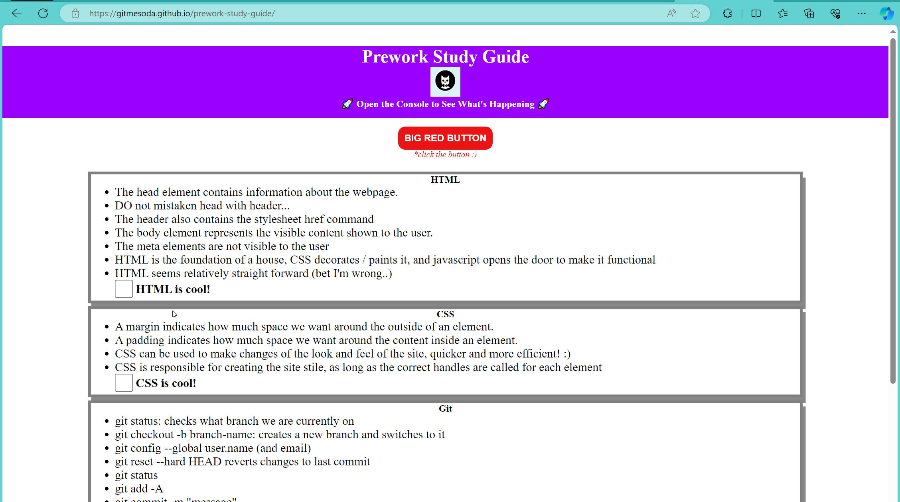

# Chris Pappas // Web Developer Portfolio

This is my personal portfolio website showcasing my journey as a front-end developer.

## Table of Contents
- [About Me](#about-me)
- [Work](#work)
- [Contact Me](#contact-me)

## About Me
I am passionate about web development and constantly improving my skills. This section provides some information about me.

## Work
Here are some examples of my work:

### Example 1

This is what I created for my prework project, I utlised different styles including checkboxes / strikethroughs.
[View Example](https://gitmesoda.github.io/prework-study-guide/)

### Example 2

In this example, we deployed and fixed a responsive site for client Horiseon.
[View Example](https://gitmesoda.github.io/horiseon/)

## Contact Me
Feel free to reach out to me via email: christos.pappas@outlook.com.
